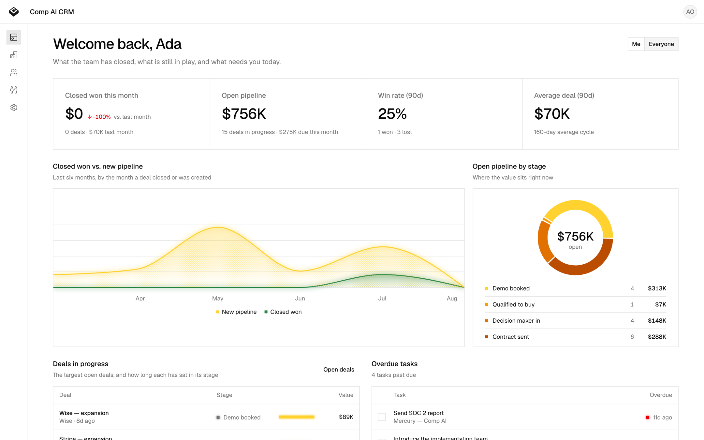
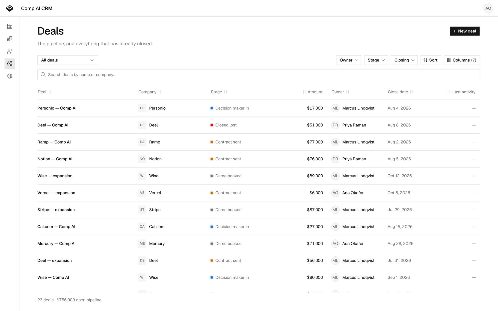
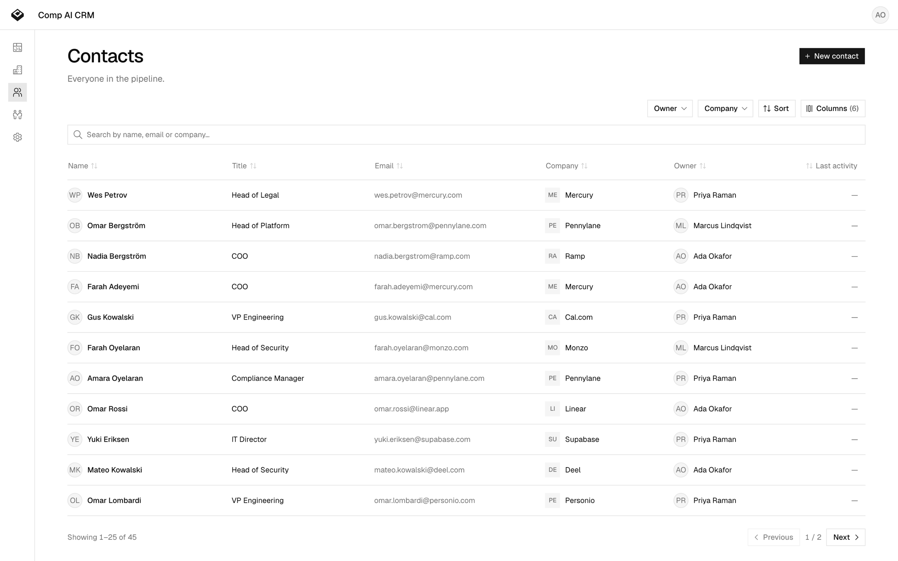
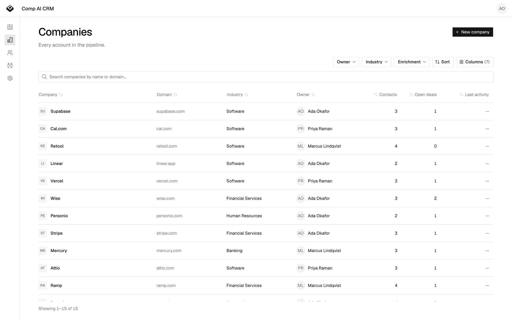

<h1 align="center">CRM</h1>

<p align="center">
  An open-source CRM that fills itself in.<br>
  It reads your Gmail and Calendar, works out who the people are, and writes what it learns onto the record.
</p>

<p align="center">
  <a href="#quick-start"><strong>Quick start</strong></a> ·
  <a href="#configuration"><strong>Configuration</strong></a> ·
  <a href="#the-agent"><strong>The agent</strong></a> ·
  <a href="#deploying"><strong>Deploying</strong></a> ·
  <a href="./CONTRIBUTING.md"><strong>Contributing</strong></a>
</p>

<p align="center">
  
  
  
</p>

<p align="center">
  <picture>
    <source media="(prefers-color-scheme: dark)" srcset="./docs/images/overview-dark.png">
    
  </picture>
</p>

---

## What this is

Most CRMs are a database with a form in front of it. Somebody has to type into that
form, and nobody does, so the data rots and the tool becomes a place deals go to be
forgotten.

This one is built the other way round. Gmail and Calendar are the source of truth:
when you email a customer, the thread lands on their record; when you take a meeting
with someone new, they become a contact at a company that already has a logo and an
industry. A research agent then works out who these people actually are — real name,
current title, employer — and writes it down with the evidence attached.

The rule it never breaks: **nothing about a person is guessed.** A contact who arrived
as `pmarchetti@example.com` is called "Pmarchetti" until something proves otherwise —
the address is not a name, and a model asked what it stands for will happily invent
someone. A confidently wrong fact about a customer is worse than a blank field,
because nobody can tell it is wrong.

It is single-tenant and internal by design. Sign-in is Google, the allow-list is one
environment variable, and everyone who gets in can see everything. That is the whole
authorisation model — see [SECURITY.md](./SECURITY.md) before you point it at real
customer data.

## Screenshots

<table>
  <tr>
    <td width="50%">
      <picture>
        <source media="(prefers-color-scheme: dark)" srcset="./docs/images/deals-dark.png">
        
      </picture>
      <p align="center"><sub><b>Deals</b> — filters, sort and page live in the URL, so a view is a link.</sub></p>
    </td>
    <td width="50%">
      <picture>
        <source media="(prefers-color-scheme: dark)" srcset="./docs/images/contacts-dark.png">
        
      </picture>
      <p align="center"><sub><b>Contacts</b> — most of these were created by the mailbox sync, not typed.</sub></p>
    </td>
  </tr>
  <tr>
    <td width="50%">
      <picture>
        <source media="(prefers-color-scheme: dark)" srcset="./docs/images/companies-dark.png">
        
      </picture>
      <p align="center"><sub><b>Companies</b> — logo, industry and location arrive on their own.</sub></p>
    </td>
    <td width="50%">
      <picture>
        <source media="(prefers-color-scheme: dark)" srcset="./docs/images/overview-dark.png">
        
      </picture>
      <p align="center"><sub><b>Overview</b> — yours or the whole team's, toggled in the URL.</sub></p>
    </td>
  </tr>
</table>

## Quick start

You need [Bun](https://bun.com) and Docker.

```sh
git clone https://github.com/trycompai/crm.git && cd crm
bun install

docker compose up -d          # Postgres on :5432
cp .env.example .env          # then fill in the four values below

bun run db:deploy             # apply migrations
bun run db:seed               # optional: a believable pipeline to look at
bun run dev
```

The app is on [localhost:3000](http://localhost:3000), the API on
[localhost:3001](http://localhost:3001).

### The four values

Open `.env` and set these. Everything else in the file is optional and commented out.

| Variable                                   | What to put in it                                                    |
| ------------------------------------------ | -------------------------------------------------------------------- |
| `BETTER_AUTH_SECRET`                       | `openssl rand -base64 32`                                             |
| `ALLOWED_SIGN_IN`                          | Your email domain, e.g. `acme.com`. Or one address, e.g. `you@gmail.com`. |
| `GOOGLE_CLIENT_ID` / `GOOGLE_CLIENT_SECRET`| A Google OAuth client — 2 minutes, below.                             |

`DATABASE_URL` already matches the `docker compose` Postgres, so leave it alone unless
you brought your own.

<details>
<summary><strong>Getting the Google OAuth client</strong></summary>

1. [Google Cloud console](https://console.cloud.google.com/apis/credentials) → **Credentials** → **Create credentials** → **OAuth client ID** → **Web application**.
2. Under **Authorised redirect URIs**, add `http://localhost:3001/api/auth/callback/google`.
3. Enable the [Gmail API](https://console.cloud.google.com/apis/library/gmail.googleapis.com) and the [Calendar API](https://console.cloud.google.com/apis/library/calendar-json.googleapis.com) for the project.
4. Copy the client ID and secret into `.env`.

Google sign-in is the only way in, so the API will not start without these. If your
account is on a Google Workspace domain, set the consent screen to **Internal** and
nobody outside your org can even reach the prompt.

</details>

`ALLOWED_SIGN_IN` is the entire authorisation model — an unset value means nobody can
sign in, which is the safe direction to fail. It takes whole domains, individual
addresses, or a mix:

```sh
ALLOWED_SIGN_IN="acme.com"                       # everyone at your company
ALLOWED_SIGN_IN="acme.com,contractor@gmail.com"  # …plus one outsider
ALLOWED_SIGN_IN="you@gmail.com"                  # a one-person install
```

## Configuration

**There is one `.env`, at the root of the repo**, read by all three processes. Real
environment variables always win, so on a hosting platform you configure it there and
the file is purely a local convenience.

Beyond the four required values, everything is optional and the app runs without any
of it. [`.env.example`](./.env.example) is the full list with a note on each; the
short version:

| | |
| --- | --- |
| `API_URL` / `APP_URL` | Where the two halves are served. Only needed off localhost. |
| `PERPLEXITY_API_KEY` | Lets the agent search the open web, with citations. |
| `RAPIDAPI_KEY` | Lets the agent read LinkedIn profiles for identity. |
| `CONTEXT_DEV_API_KEY` | Company logo, industry and socials from a domain. |
| `AGENT_BRIDGE_SECRET` | Lets a rep talk to the agent from a contact's **Agent** tab. |
| `REDIS_URL` | A shared cache. Without it, per-instance and in-memory. |
| `CRON_SECRET` | Guards the Gmail/Calendar sync route. Required to use it. |

## The agent

The research agent is a separate deployment in [`apps/agent`](./apps/agent), built on
[eve](https://eve.dev). The API never enriches anything itself — it queues a row that
says *this happened* (a company was created, an attendee is unknown, a meeting is
tomorrow) and the agent decides what that means.

**Every outside source it can reach is optional, and it is designed to run with none
of them.** With no API keys at all it still works: `read_crm_history` reads your own
threads, meetings and signature blocks, which is free and is the best evidence there
is — no data vendor can sell you a reply from the person's own address. Each key you
add opens one more place to look. The agent is told at the start of every session
which ones this install has, so it plans around what it actually has rather than
discovering the gaps one failed call at a time, and it prints the list at startup:

```
[agent] on   LinkedIn (RAPIDAPI_KEY)
[agent] off  Web research (PERPLEXITY_API_KEY)
[agent] off  Company brand data (CONTEXT_DEV_API_KEY)
```

Instead of asserting confidence, it reports **evidence** and a ledger scores it.
Strong evidence writes to the record; weak evidence becomes a suggestion a human
settles. Both are the system working — and if it cannot confirm something, it leaves
the field empty and says so.

You can also watch it work. Every contact has an **Agent** tab: the steps it takes as
it takes them, the leads it throws away and why, and its questions answered in place
when it cannot decide between two people. Set `AGENT_BRIDGE_SECRET` to the same value
in both processes to turn it on — without it the tab reports that it is not
configured and nothing else changes. [`docs/agent.md`](./docs/agent.md) has the
details.

## What's inside

A [Turborepo](https://turborepo.dev) monorepo on [Bun](https://bun.com).

| Path | |
| --- | --- |
| `apps/app` | [Next.js](https://nextjs.org) front end · :3000 |
| `apps/api` | [NestJS](https://nestjs.com) API — HTTP, auth, tRPC, Google sync · :3001 |
| `apps/agent` | The research agent ([eve](https://eve.dev)) |
| `packages/db` | [Prisma](https://prisma.io) schema, migrations, shared Postgres client |
| `packages/auth` | [Better Auth](https://better-auth.com) config and the sign-in allow-list |
| `packages/ui` | [shadcn/ui](https://ui.shadcn.com) components, the Tailwind theme |
| `packages/env` | Finds and loads the root `.env` |

The app talks to the API over **tRPC**, and the router type is generated from the
NestJS routers — so the front end is type-safe from the Prisma row to the table cell.
List state (filters, sort, page) lives in the URL via [nuqs](https://nuqs.dev), so
copying the address bar reproduces the view.

Three rules the codebase holds to, written up where the work happens:

- **Intelligence never lives in the API** ([docs/api.md](./docs/api.md)). Nest reports
  that something happened; the agent decides what it means. Two copies of an identity
  matcher once drifted until one matched every employer on earth.
- **`packages/ui` is the only source of UI** ([docs/design.md](./docs/design.md)). No
  overriding styles at the call site.
- **There are no organizations.** Single tenant, deliberately. An `organizationId`
  that is always the same value is a column, an index and a permissions check that
  buys nothing and reads like a real one at review time.

## Tasks

| Command | |
| --- | --- |
| `bun run dev` | Everything, in watch mode |
| `bun run build` | Build all apps and packages |
| `bun run test` | Run the test suite |
| `bun run check-types` | `tsc --noEmit` everywhere |
| `bun run lint` / `format` | [Biome](https://biomejs.dev) |
| `bun run db:migrate` | Create and apply a migration |
| `bun run db:seed` | Top up the demo pipeline (idempotent) |
| `bun run db:studio` | Prisma Studio |
| `bun run --filter=api trpc:generate` | Regenerate the `AppRouter` type |
| `bun run --filter=api dev:session` | Print a session cookie for a local user |

Scope any of them with a Turborepo filter: `bun run dev --filter=api`.

Because Google is the only door, there is no way to get a session from a terminal —
`dev:session` writes the rows Better Auth would have written and prints the cookie it
would have set. It refuses to run with `NODE_ENV=production`.

## Deploying

Three deployments and a Postgres: the Next.js app, the NestJS API, and the agent.
They are independent, and the only thing they must agree on is `DATABASE_URL` and
`BETTER_AUTH_SECRET` — the API mints the session cookie and the app verifies it, so a
mismatch is a redirect loop rather than an error.

Set `API_URL` and `APP_URL` to the real origins, and if the two are on different
subdomains of one parent, set `AUTH_COOKIE_DOMAIN` to the parent so one cookie covers
both. Add `http://your-api-host/api/auth/callback/google` to the OAuth client's
redirect URIs. Set `CRON_SECRET` and point a scheduler at
`POST /internal/sync/google` to keep the mailbox sync running.

`apps/api/src/generated/server.ts` is committed and `build` must never regenerate it —
the generator needs a newer GLIBC than most build images have. Regenerate locally and
commit it with the router change that caused it.

## Contributing

We'd rather have a paragraph you wrote than a pull request an agent wrote. See
[CONTRIBUTING.md](./CONTRIBUTING.md).

Security issues go through [SECURITY.md](./SECURITY.md), privately, not a public
issue.

## Licence

[MIT](./LICENSE).
